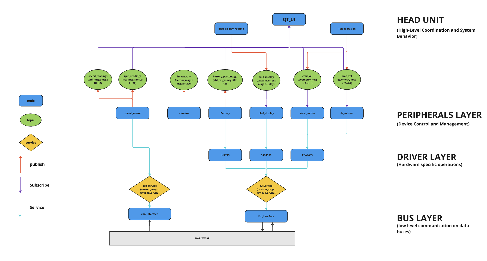

## Overview

This folder contains the ROS2 workspace and its source code. The codebase is organized into a modular structure, where each package represents a ROS2 node encapsulating a specific aspect of the system. The architecture is divided into three main layers, each with its own responsibility:

- **Bus Interfaces**: Directly interact with hardware via different protocols (CAN, I2C).
- **Drivers**: Defines device specific operations.
- **Peripherals**: Communicate with the drivers and manage higher-level device functionality.
- **Head Unit**: Coordinates the peripherals and handles higher-level logic.
---

## Software Architecture



The project structure follows a clear layered architecture that helps isolate responsibilities and ensures modularity. The three main layers are:

### 1. **Bus Interfaces (can_interface, i2c_interface)**
These packages manage the direct interaction with hardware data buses. They are the closest to the hardware and abstract the communication with physical devices such as CAN and I2C interfaces.
- **Responsibility**: Communicate with hardware via data buses (CAN, I2C).
- **ROS2 Mechanism**: Provide services or topics for peripheral nodes to interact with hardware.

### 2. **Drivers (abstract_driver, pca9685_driver, etc.)**
Drivers encapsulate device-specific logic into reusable objects. Each driver handles the low-level details of interacting with its associated hardware. These drivers are now decoupled from the peripheral nodes to promote code reuse and maintainability.
- **Responsibility**: Provide device-specific functionality, abstracting away low-level hardware interactions.
- **Design Improvement**: Peripheral nodes now hold an instance of their corresponding driver. If the driver fails to initialize (e.g., due to hardware issues), the peripheral node will not start, preventing undefined behavior or unnecessary crashes.
- **ROS2 Mechanism**: Exposed as libraries to be used by peripherals or other nodes.

### 3. **Peripherals (oled_display, servo_motor, dc_motors, etc.)**
Peripherals interact with drivers to manage the higher-level functionality of each device. For example, the `servo_motor` package uses the `pca9685_driver` to control servos. Each peripheral node initializes its driver and interact with the bus interfaces via his driver instance.
- **Responsibility**: Manage higher-level device functionality and interact with drivers.
- **Design Improvement**: Peripheral nodes depend on the proper initialization of their corresponding driver. If the driver cannot initialize successfully (e.g., due to a missing or malfunctioning device), the peripheral node will fail gracefully.

### 4. **Head Unit (coordinator, infotainment)**
The head unit represents the higher-level logic of the system, coordinating the operation of peripherals and providing user interaction functionality (e.g., infotainment system, control coordination).
- **Responsibility**: Coordinate and manage the operation of peripherals.
- **ROS2 Mechanism**: Provide high-level functionalities and user interactions through nodes that communicate with peripheral nodes.

---

## Launch Instructions

1. Ensure you have all the required files
```bash 
ll /etc/systemd/system/jetracer@.service
ll /usr/local/bin/jetracer_manual.sh
ll /usr/local/bin/jetracer_auto.sh
```
2. To launch the Jetracer in manual mode (with teleop node):
```bash
sudo systemctl start jetracer@manual
```

3. To Launch the Jetracer in auto mode:
```bash
sudo systemctl start jetracer@auto
```

3. WARNING: To be able to have access to the QT UI, you need to launch the script manually and not via systemctl. You can simply call the script the following way since its your path:
```bash
jetracer_manual.sh
```
