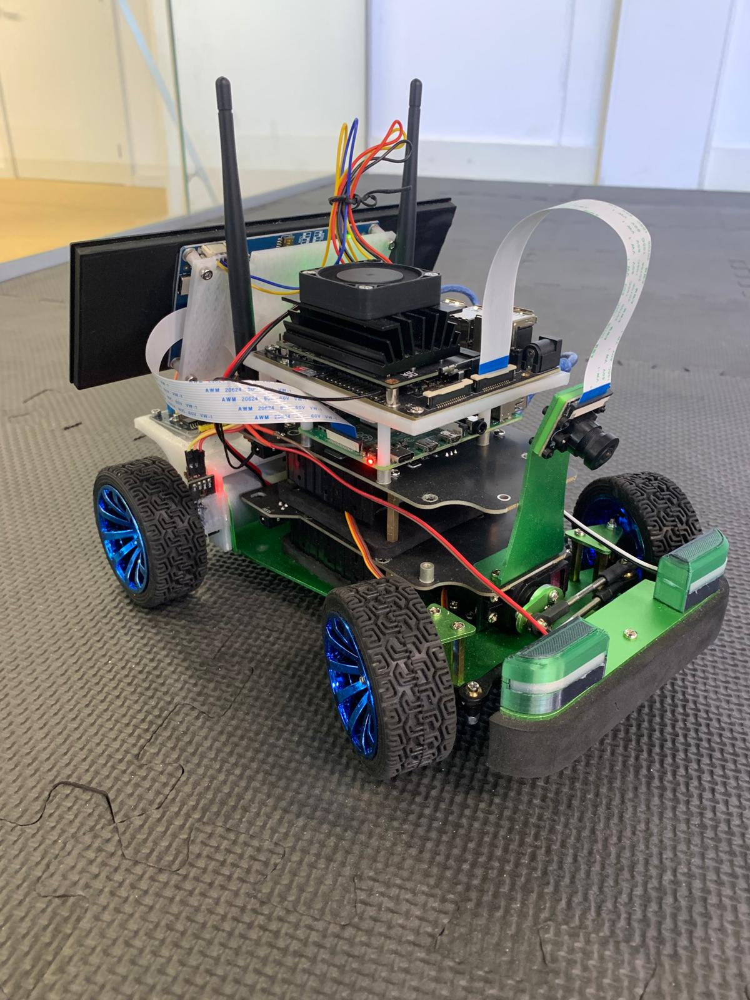

# JetPackJoyRide - Instrument Cluster

  

## 📌 About

The Instrument Cluster project aims to design a viable system for a [Jetracer](https://www.waveshare.com/wiki/JetRacer_AI_Kit) car and create a real-time infotainment system for it. The application(s) will run on a Raspberry Pi 4 and use the Controller Area Network (CAN) protocol to receive speed data from a speed sensor, and the I2c protocol as the communication protocol used to control the motors of the car. This project provides hands-on experience in software engineering, including embedded systems, communication protocols, and GUI development with Qt, a framework widely used in the automotive industry.

The project showcase our ability to design and implement real-world software solutions and effectively communicate results.

Code documentation can be found here:  [JetRacer Documentation](https://xyckens.github.io/SEAME-Cluster-24-25/)

---

## 📁 Repo strucutre

- **Jetracer**: ROS2 workspace with the source code running on the raspberryPi
- **JetRacer_container**: Contain the Dockerfile to build the project in a container as well as launch script to put the container up with access rights to essential hardware components.
- **ECU_code**: code running on the **Arduino uno**

---

## 🔧 Hardware

- **Raspberry Pi 4**: Ideal for handling the computational requirements of real-time GUI and CAN data processing.
- **Jetson nano**: Ideal for handling image processing / machine learning (GPU accelerated computation)
- **Arduino uno**: Acts as an Electronic control unit collecting speed sensor data and controlling blinker state
- **CAN Bus Interface**: MCP2515 for interfacing with the Raspberry Pi 4.
- **Speed Sensor**: LM393 infrared speed sensor.
- **Display**: LCD/OLED display for GUI visualization.

--- 

## 🎯 Goals and Objectives

### Main Goal

To develop a functional instrument cluster for the JetRacer car, displaying real-time speed data from a speed sensor via the CAN bus among other sensor system infos.

### Specific Objectives

- Design and implement a Qt-based graphical user interface (GUI).
- Integrate a speed sensor system with the Raspberry Pi 4 using the CAN bus protocol.
- Display real-time speed data on the instrument cluster GUI.
- Test functionality using realistic driving scenarios.
- Document the project, including system architecture, design, and implementation.

**Bonus Objective:** Display battery level on the instrument cluster.
